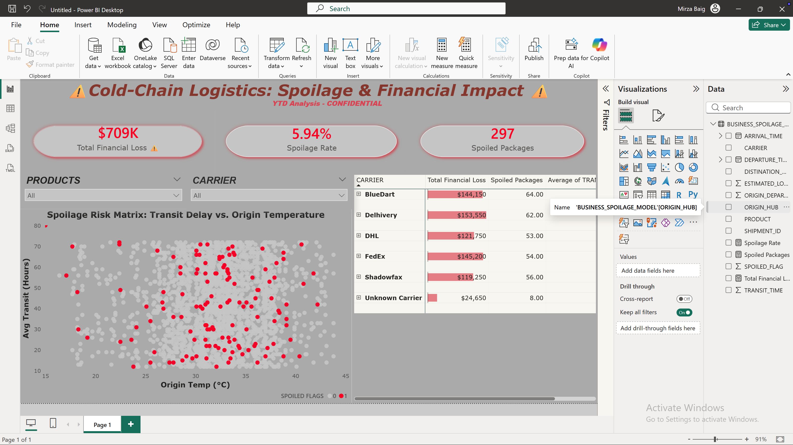

# Cold-Chain Logistics: End-to-End Spoilage Analytics & Revenue Protection

### The Business Problem
In pharmaceutical logistics, the "cold chain" is unforgiving. A Fortune 500 logistics client was experiencing a massive spike in spoiled shipments (e.g., mRNA vaccines, biologics) but lacked visibility into the root cause. 

Management needed to move away from reactive guessing and build a proactive data engine to answer:
1. **Financial Impact:** What is the exact YTD revenue bleeding?
2. **Root-Cause Analysis:** Are products spoiling because of extreme origin weather, carrier delays, or a fatal combination of both?
3. **Accountability:** Which 3PL (Third-Party Logistics) carriers are violating their SLAs, and how do we hold them financially accountable?

### The Analytical Approach & Logical Reasoning
To solve this, I didn't just build a dashboard; I engineered a hypothesis-driven data pipeline. 
*   **The Hypothesis:** Spoilage is rarely caused by a single factor. I hypothesized that high origin temperatures combined with extended transit times were creating a "danger zone" that current packaging couldn't survive.
*   **The Logic:** I needed to join internal company shipment data with external API weather data at the exact time and location of departure to prove the correlation.
*   **The Solution:** I used **Snowflake** to handle the heavy SQL transformations and business logic, ensuring only clean, aggregated financial metrics were fed into **Power BI** for the executive presentation layer.

---

### Technical Architecture & Execution

#### 1. Data Engineering & Transformation (Snowflake SQL)
Instead of forcing Power BI to process raw data, I built an enterprise-grade pipeline in Snowflake:
*   **Data Integration:** Joined internal ERP shipment tracking data with external Origin Weather API data.
*   **Calculated Metrics:** Engineered a `TRANSIT_TIME` metric (Arrival - Departure) and flagged shipments crossing the spoilage threshold based on product temperature tolerances.
*   **Financial Logic:** Calculated the exact `ESTIMATED_LOSS_USD` directly in the data warehouse to maintain a single source of truth and reduce BI processing overhead.

#### 2. Semantic Modeling & BI (Power BI DAX)
*   Avoided implicit measures by explicitly coding an executive DAX layer (e.g., calculating the precise **5.94% Spoilage Rate**).
*   Utilized **Import Mode** to load the clean 5,000-row data mart into RAM for instantaneous executive filtering.

#### 3. UI/UX Design Psychology (Exception Reporting)
*   **Visual Hierarchy:** Designed a "Command Center" aesthetic using Dark Mode (`#1A1A1A`) to eliminate screen fatigue. 
*   **Exception Highlighting:** Restricted the use of the color **Red** strictly to financial loss and spoiled data points. This forces the end-user's eyes directly to the problem areas within 2 seconds, reducing cognitive load.

---

### Actionable Insights & Strategic Recommendations
By visualizing the data through a Scatter Matrix (Transit Time vs. Temp) and a hierarchical Carrier Matrix, the data proved the following:

*   **Revenue Bleeding:** The company has lost **$709,550** YTD due to 297 spoiled packages. 
*   **The Root Cause:** The scatter plot conclusively proves that spoilage clusters violently when origin temperatures exceed 30°C AND transit times exceed 40 hours. The packaging fails under this specific combined stress.
*   **Carrier Accountability:** **Delhivery** ($153K loss) and **FedEx** ($145K loss) are the primary offenders. 

**Business Recommendations for the Supply Chain Director:**
1. Instantly trigger SLA penalty clauses with Delhivery and FedEx to recoup the $298K lost.
2. Mandate upgraded "heavy-duty" thermal packaging exclusively for shipments departing from hubs experiencing temperatures >30°C if the route takes longer than 40 hours.
